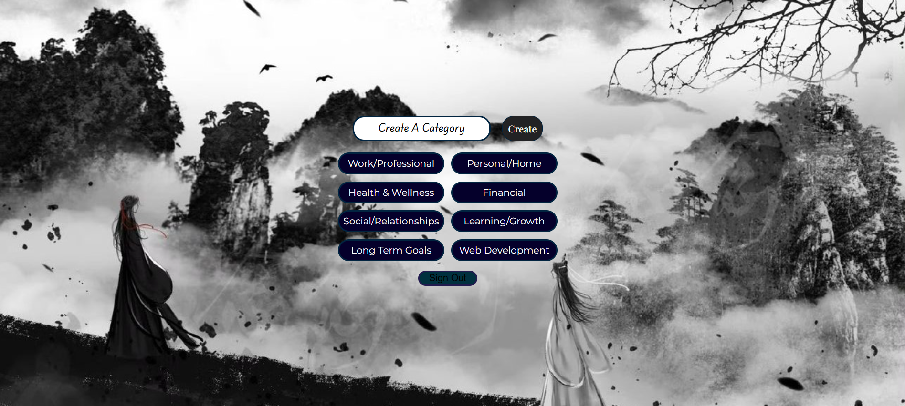
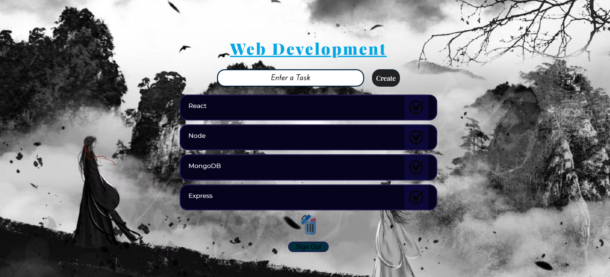

# Let's Do It - Personal Task Manager

A feature-rich, category-based to-do list web application with user authentication and personalized task management.


## 📋 Table of Contents

- [Features](#features)
- [Demo](#demo)
- [Technologies Used](#technologies-used)
- [Getting Started](#getting-started)
- [Project Structure](#project-structure)
- [Usage](#usage)
- [Known Issues](#known-issues)
- [Future Enhancements](#future-enhancements)
- [Contributing](#contributing)
- [License](#license)

## ✨ Features

### User Authentication
- **Sign Up**: Create a new account with username and password
- **Sign In**: Secure login for existing users
- **Password Validation**: Minimum 4 characters required
- **Persistent Sessions**: Stay logged in using localStorage

### Category Management
- **Default Categories**: 7 pre-loaded categories including:
  - Work/Professional
  - Personal/Home
  - Health & Wellness
  - Financial
  - Social/Relationships
  - Learning/Growth
  - Long Term Goals
- **Custom Categories**: Create unlimited custom categories
- **Category Deletion**: Remove entire task categories with confirmation

### Task Management
- **Add Tasks**: Create tasks within specific categories
- **Complete Tasks**: Mark tasks as done with visual confirmation
- **Delete Tasks**: Remove completed tasks from your list
- **Per-User Storage**: Each user has their own isolated task data
- **Duplicate Prevention**: Prevents adding duplicate tasks or categories

### User Experience
- **Responsive Design**: Clean, centered layout with custom fonts
- **Visual Feedback**: Hover effects and opacity changes on interactive elements
- **Confirmation Dialogs**: Prevents accidental deletions
- **Background Theming**: Aesthetic background image with overlay

## 🎨 Demo

### Website Demo
[Checkout The Website](https://5h-am.github.io/to_do_list_js/)

### Screenshots

**Login Screen**


**Category Selection**




**Task List View**




## 🛠️ Technologies Used

- **HTML5**: Semantic markup structure
- **CSS3**: Custom styling with Google Fonts
  - Playfair Display (headings)
  - Montserrat (body text)
  - Playwrite NZ Basic (placeholders)
- **Vanilla JavaScript**: DOM manipulation and logic
- **LocalStorage API**: Client-side data persistence
- **SessionStorage API**: Temporary state management

## 🚀 Getting Started

### Prerequisites

- A modern web browser (Chrome, Firefox, Safari, Edge)
- No server or dependencies required!

### Installation

1. **Clone the repository**
   ```bash
   git clone https://github.com/5h-am/to_do_list_js
   cd lets-do-it
   ```

2. **Add required images**
   
   Place these images in your project directory:
   - `todolist_bg-image.jpeg` - Background image
   - `completed_icon.jpeg` - Task completion icon
   - `delete_icon.jpeg` - Category deletion icon

3. **Open in browser**
   ```bash
   # Simply open index.html in your browser
   # Or use a local server:
   python -m http.server 8000
   # Then navigate to http://localhost:8000
   ```

### Quick Start

1. Open `index.html` in your browser
2. Click "Register" to create an account
3. Enter username and password (min 4 characters)
4. Sign in with your credentials
5. Select or create a category
6. Start adding tasks!

## 📁 Project Structure

```
lets-do-it/
│
├── index.html              # Main HTML structure
├── style.css               # Styling and layout
├── script.js               # Application logic
├── todolist_bg-image.jpeg  # Background image
├── completed_icon.jpeg     # Task completion icon
├── delete_icon.jpeg        # Delete category icon
└── README.md              # This file
```

### File Breakdown

**index.html**
- Sign-in/Sign-up forms
- Category creation interface
- Task management UI
- All screens in single-page app structure

**style.css**
- Responsive flexbox/grid layouts
- Custom font integration
- Dark theme with blue/purple accent colors
- Hover and focus states

**script.js**
- User authentication logic
- LocalStorage data management
- Dynamic DOM manipulation
- Event handling for all interactions

## 📖 Usage

### Creating an Account

1. Click "Register" on the sign-in page
2. Enter a unique username
3. Enter password (minimum 4 characters)
4. Confirm your password
5. Click "Sign Up"

### Managing Categories

**Create a Category:**
```
1. Enter category name in input field
2. Click "Create" button
3. Category appears as a button below
```

**Delete a Category:**
```
1. Open the category
2. Click the delete icon (🗑️)
3. Confirm deletion
4. All tasks in category are removed
```

### Managing Tasks

**Add a Task:**
```
1. Select a category
2. Type task in input field
3. Click "Create"
4. Task appears in list
```

**Complete a Task:**
```
1. Click the checkmark icon (✓)
2. Confirm completion
3. Task is removed from list
```

### Signing Out

- Click "Sign Out" button on any screen
- Confirm sign out
- Returns to login screen

## ⚠️ Known Issues

### Security Concerns
- ⚠️ **Passwords stored in plain text** in localStorage
- ⚠️ No encryption or hashing
- ⚠️ Vulnerable to XSS attacks
- ⚠️ Not suitable for sensitive data

**Note**: This is a client-side demo project. For production use, implement proper backend authentication.

### Browser Compatibility
- Requires localStorage support
- Best experience on modern browsers
- May have issues with older browsers

## 🔮 Future Enhancements

### High Priority
- [ ] Fix security vulnerabilities (backend authentication)
- [ ] Fix login validation bug
- [ ] Clear DOM when switching categories
- [ ] Add proper input validation
- [ ] Implement password hashing

### Features
- [ ] Task priorities (High, Medium, Low)
- [ ] Due dates and reminders
- [ ] Task notes/descriptions
- [ ] Search and filter functionality
- [ ] Dark/Light theme toggle
- [ ] Export tasks to CSV/PDF
- [ ] Drag-and-drop task reordering
- [ ] Task categories with colors
- [ ] Progress tracking and statistics
- [ ] Mobile responsive improvements

### Technical Improvements
- [ ] Refactor to ES6 modules
- [ ] Add a build process (Webpack/Vite)
- [ ] Implement proper state management
- [ ] Add unit tests
- [ ] Improve accessibility (ARIA labels)
- [ ] Add keyboard navigation
- [ ] Convert to Progressive Web App (PWA)
- [ ] Add backend API integration

## 🤝 Contributing

Contributions are welcome! Here's how you can help:

1. Fork the repository
2. Create a feature branch (`git checkout -b feature/AmazingFeature`)
3. Commit your changes (`git commit -m 'Add some AmazingFeature'`)
4. Push to the branch (`git push origin feature/AmazingFeature`)
5. Open a Pull Request

### Contribution Guidelines
- Follow existing code style
- Add comments for complex logic
- Test thoroughly before submitting
- Update README if adding new features

## 📝 License

This project is licensed under the MIT License - see below for details:

```
MIT License

Copyright (c) 2024 [Your Name]

Permission is hereby granted, free of charge, to any person obtaining a copy
of this software and associated documentation files (the "Software"), to deal
in the Software without restriction, including without limitation the rights
to use, copy, modify, merge, publish, distribute, sublicense, and/or sell
copies of the Software, and to permit persons to whom the Software is
furnished to do so, subject to the following conditions:

The above copyright notice and this permission notice shall be included in all
copies or substantial portions of the Software.

THE SOFTWARE IS PROVIDED "AS IS", WITHOUT WARRANTY OF ANY KIND, EXPRESS OR
IMPLIED, INCLUDING BUT NOT LIMITED TO THE WARRANTIES OF MERCHANTABILITY,
FITNESS FOR A PARTICULAR PURPOSE AND NONINFRINGEMENT. IN NO EVENT SHALL THE
AUTHORS OR COPYRIGHT HOLDERS BE LIABLE FOR ANY CLAIM, DAMAGES OR OTHER
LIABILITY, WHETHER IN AN ACTION OF CONTRACT, TORT OR OTHERWISE, ARISING FROM,
OUT OF OR IN CONNECTION WITH THE SOFTWARE OR THE USE OR OTHER DEALINGS IN THE
SOFTWARE.
```

## 👨‍💻 Author

**Your Name**
- GitHub: [5h-am](https://github.com/5h-am)
- Email: shame06rxl@gmail.com

## 🙏 Acknowledgments

- Google Fonts for typography
- Inspiration from various to-do list applications
- The web development community

---

**⭐ If you found this project helpful, please consider giving it a star!**

*Last Updated: February 2026*